<div align="center">

# pytest-agentreplay

**Framework-agnostic regression testing for AI agents**

[](https://github.com/aafre/agentreplay/actions)
[](https://pypi.org/project/pytest-agentreplay/)
[](https://pypi.org/project/pytest-agentreplay/)
[](https://mypy-lang.org/)
[](https://github.com/astral-sh/ruff)

Record real model and tool interactions once, replay them offline in pytest with zero API calls, and detect behavioural regressions with structured trajectory diffs.

[Overview](#overview) • [Demo](#demo) • [Examples](#real-world-examples) • [Features](#features) • [Installation](#installation) • [Quick Start](#quick-start) • [How It Works](#how-it-works) • [Cassette Format](#cassette-format) • [CLI & Fixture Reference](#cli--fixture-reference) • [Development](#development)

</div>

---

## Demo

<div align="center">
  
</div>

---

## Overview

Testing AI agents in continuous integration is often painful:
- **Live LLM calls in CI are slow, expensive, and flaky.**
- **Traditional mocks are brittle** and easily miss subtle agent drifts (such as skipping a verification tool or altering argument payloads).
- **Raw snapshot tests generate massive, noisy JSON diffs** cluttered with timestamps, request IDs, and non-deterministic tokens.

`pytest-agentreplay` brings deterministic VCR-style testing to AI agents:

1. **Record once** against live models and tools during local test development.
2. **Replay offline** in CI with zero network and zero model API calls.
3. **Catch behavioural drift** with step-by-step trajectory diffs whenever tools, arguments, or execution sequences change.

> [!NOTE]
> `pytest-agentreplay` is a testing tool, not an agent runtime or orchestration system. You don't need to rewrite your agent or replace your framework runtime.

---

## Features

- ⚡ **Zero-API Replay**: Substitutes model responses and tool executions offline — test suites execute in milliseconds.
- 🔍 **Structural Trajectory Diffs**: Highlights the exact step where an agent diverged instead of dumping raw JSON walls.
- 🎯 **Non-Invasive Adapter**: Integrates with PydanticAI via public capability hooks without monkey-patching HTTP clients.
- 🛡️ **No Silent Fallback**: Replay never secretly falls back to live network calls; cassette exhaustion and unexpected tool calls fail loudly.
- 📦 **Git-Friendly Cassettes**: Canonical JSONL serialization (sorted keys, compact separators) produces byte-identical files across operating systems.
- 🧪 **Pytest-Native**: Integrated `--agentreplay` CLI option and test fixture for seamless workflow switching.

---

## Installation

Install `pytest-agentreplay` using `uv` or `pip`:

```bash
# Using uv (recommended)
uv add pytest-agentreplay

# Using pip
pip install pytest-agentreplay
```

To include development dependencies:

```bash
uv add --dev pytest-agentreplay[pydantic-ai,pytest]
```

---

## Quick Start

### 1. Using the pytest Fixture (Recommended)

Add the `agentreplay` fixture to your existing test function. The cassette path is automatically derived from the test module and function name:

```python
from your_app import support_agent


def test_refund_flow(agentreplay):
    caps = [c for c in [agentreplay.capability()] if c is not None]
    result = support_agent.run_sync("Refund order 123", capabilities=caps)

    assert "refund" in result.output.lower()
```

#### Step 1: Record Real Interactions
Run pytest with `--agentreplay=record` to capture live model and tool events into a cassette:

```bash
pytest --agentreplay=record tests/test_refund.py
```
```
RECORD  tests/cassettes/test_refund/test_refund_flow.jsonl
✓ model interactions recorded
✓ tool interactions recorded
```

#### Step 2: Replay Offline in CI
Run with `--agentreplay=replay` to run tests entirely offline:

```bash
pytest --agentreplay=replay tests/test_refund.py
```
```
REPLAY  tests/cassettes/test_refund/test_refund_flow.jsonl
✓ zero model API calls
✓ zero network
✓ deterministic
```

> [!TIP]
> Running `pytest` without the `--agentreplay` flag executes tests normally without recording or intercepting interactions.

---

### 2. Programmatic Usage

You can also control recording and replaying explicitly in code without pytest CLI flags:

```python
import agentreplay
from your_app import support_agent


def test_custom_refund():
    result = support_agent.run_sync(
        "Refund order 123",
        capabilities=[
            agentreplay.pydantic_ai(
                mode="replay",  # or "record"
                cassette_path="tests/cassettes/custom_refund.jsonl",
            )
        ],
    )
    assert "refund" in result.output.lower()
```

<details>
<summary><b>Interactive Live Example (Click to expand)</b></summary>

Here is a complete, self-contained example you can run immediately without API keys using PydanticAI's built-in `TestModel`:

```python
from pathlib import Path
from pydantic_ai import Agent
from pydantic_ai.models.test import TestModel
from pydantic_ai.tools import RunContext
import agentreplay


# 1. Define your agent & tools
def lookup_customer(ctx: RunContext[None], customer_id: str) -> str:
    return f"Customer {customer_id}: Alice (tier=gold)"


support_agent = Agent(
    TestModel(call_tools=["lookup_customer"]),
    tools=[lookup_customer],
)

cassette = Path("test_refund.jsonl")

# 2. Record: live interaction captured to JSONL
cap_record = agentreplay.pydantic_ai(mode="record", cassette_path=cassette)
record_result = support_agent.run_sync("Find customer 123", capabilities=[cap_record])
print("Recorded output:", record_result.output)

# 3. Replay: 100% offline, zero model/tool execution
cap_replay = agentreplay.pydantic_ai(mode="replay", cassette_path=cassette)
replay_result = support_agent.run_sync("Find customer 123", capabilities=[cap_replay])
print("Replayed output:", replay_result.output)
assert record_result.output == replay_result.output
```
</details>

---

## Behavioural Trajectory Diffs

When an agent changes its decision path (e.g. prompt changes, tool parameter updates, or model upgrade drifts), `agentreplay` provides a clear, numbered trajectory diff:

```
FAILED tests/test_refund.py::test_refund_flow - DivergenceError:

Agent trajectory changed

Expected:
  1. model_request
  2. tool_call: lookup_customer(id='123')
  3. tool_call: check_refund_policy(tier='gold')
  4. tool_call: refund_customer(amount=39)
  5. model_response → "Refund processed."

Actual:
  1. model_request
  2. tool_call: lookup_customer(id='123')
  3. tool_call: refund_customer(amount=39)

Divergence at step 3:
  - tool_call: check_refund_policy(tier='gold')
  + tool_call: refund_customer(amount=39)
```

---

## Real-World Examples

Explore fully functional agent examples in the [`examples/`](examples) directory:

| Example | Scenario | Why Replay Matters |
|---|---|---|
| **[E-Commerce Refund Agent](examples/ecommerce_support/)** | Multi-step agent with fraud detection, tier calculations, and payment gateway calls. | Catches silent regressions where prompt changes bypass fraud checks before issuing refunds. |
| **[SQL Data Analyst Agent](examples/sql_analyst/)** | Natural-language-to-SQL agent with schema discovery and read-only query guardrails. | Tests query planning and schema lookup trajectories in CI without spinning up live database replicas. |
| **[DevOps Incident Triage Agent](examples/devops_incident/)** | Operations agent parsing cluster logs, evaluating change policy, and executing remediations. | Prevents unsafe direct restarts by ensuring diagnostic logs & policy checks are never bypassed. |
| **[Customer Support Agent](examples/support_agent.py)** | Standalone customer tier lookup and policy verification demo. | Minimal single-file reference for quick onboarding. |

---

## How It Works

```
┌────────────────────────────────────────────────────────┐
│                      Agent Test                        │
└───────────────────────────┬────────────────────────────┘
                            │
              ┌─────────────┴─────────────┐
              ▼                           ▼
      [Record Mode]               [Replay Mode]
              │                           │
     Live Model & Tools           Cassette JSONL File
              │                           │
  Intercepts via Capability       Intercepts via Hooks:
    • Model Requests/Responses      • SkipModelRequest
    • Tool Calls/Results            • SkipToolExecution
              │                           │
              ▼                           ▼
   Saves Canonical JSONL         Zero Network / API Calls
```

- **Record Mode**: Intercepts model requests, model responses, and tool executions via PydanticAI's `AbstractCapability` hooks. Deep-copies all arguments and results to prevent mutation side-effects.
- **Replay Mode**: Uses PydanticAI's `SkipModelRequest` to return recorded responses without model invocations, and `SkipToolExecution` to substitute recorded tool outputs.
- **Divergence Engine**: Tracks execution position with a stateful cursor. Rejects mismatches in event kinds, unexpected tool names, altered arguments, cassette exhaustion, and unconsumed leftover events.

---

## Cassette Format

Cassettes are stored as streamable, Git-diffable **JSON Lines (JSONL)** files.

Line 1 contains the cassette header with format versioning and metadata:
```json
{"created_at":"2026-08-27T08:30:00+00:00","format_version":1,"framework":"pydantic-ai"}
```

Subsequent lines contain canonical `TraceEvent` records:
```json
{"event_id":"a1b2c3d4e5f6","kind":"run_start","timestamp":1724747400.0}
{"event_id":"b2c3d4e5f6a1","kind":"model_request","name":"gpt-4o","timestamp":1724747401.0}
{"arguments":{"customer_id":"123"},"event_id":"c3d4e5f6a1b2","kind":"tool_result","name":"lookup_customer","result":{"tier":"gold"},"timestamp":1724747402.0}
{"event_id":"d4e5f6a1b2c3","kind":"model_response","result":{"parts":[{"content":"Processed.","part_kind":"text"}]},"timestamp":1724747403.0}
{"event_id":"e5f6a1b2c3d4","kind":"run_end","timestamp":1724747404.0}
```

> [!IMPORTANT]
> Serialization is deterministic: dictionary keys are sorted, compact separators are enforced, and encoding is UTF-8. Logically identical traces produce byte-identical files across platforms.

---

## CLI & Fixture Reference

### Pytest CLI Flags

| Flag | Description |
|---|---|
| `--agentreplay=record` | Run live tests and record interactions into cassette files. |
| `--agentreplay=replay` | Run tests offline using recorded cassettes; fail on behavioural divergence. |
| *(no flag)* | Standard pytest execution without recording or replay interception. |

### `agentreplay` Fixture Methods

- `agentreplay.mode` — Returns `"record"`, `"replay"`, or `None`.
- `agentreplay.capability(cassette_path=None)` — Creates an `AgentReplayCapability` instance configured with the active mode and target cassette path.
- `agentreplay.default_cassette_path` — Returns the auto-derived path: `tests/cassettes/{module_name}/{test_name}.jsonl`.

---

## Development

Set up a local development environment with `uv`:

```bash
# Clone the repository
git clone https://github.com/aafre/agentreplay.git
cd agentreplay

# Install dependencies
uv sync --all-extras

# Run quality gates
uv run ruff check .
uv run ruff format --check .
uv run mypy .
uv run pytest -v
```
