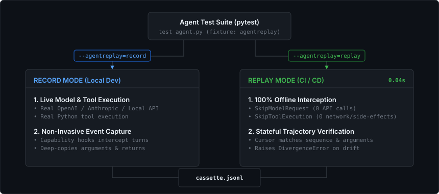

<div align="center">

# pytest-agentreplay 📼

### Framework-Agnostic Regression Testing for AI Agents

**Record real model and tool interactions once, replay them offline in pytest with zero API calls, and detect behavioural regressions with structured trajectory diffs.**

[](https://github.com/aafre/agentreplay/actions)
[](https://pypi.org/project/pytest-agentreplay/)
[](https://pypi.org/project/pytest-agentreplay/)
[](LICENSE)
[](https://mypy-lang.org/)
[](https://github.com/astral-sh/ruff)

[Quick Start](#quick-start) • [Supported Frameworks](#supported-frameworks--adapters) • [How It Works](#how-it-works) • [Cassette Format](#cassette-format) • [Examples](#real-world-examples) • [CLI Reference](#cli--fixture-reference)

</div>

---

<div align="center">
  
</div>

<br>

| Capability | Live LLMs in CI | Traditional Mocks | `pytest-agentreplay` |
|---|:---:|:---:|:---:|
| **CI Execution Speed** | 🐌 15s – 60s+ | ⚡ < 1s | ⚡ **< 0.05s (60x faster)** |
| **API Costs & Rate Limits** | 💸 High & Flaky | 🆓 Zero | 🆓 **Zero ($0.00 tokens)** |
| **Catches Prompt Drift** | ❌ Stochastic | ❌ No (hardcoded return) | ✅ **Yes (Trajectory Diffs)** |
| **Detects Tool Bypass** | ⚠️ Only if output fails | ❌ Misses sequence order | ✅ **Exact Step Divergence** |
| **Maintenance Overhead** | ❌ Endless triage | ❌ Tedious mock writing | ✅ **1-command cassette update** |

---

## Overview

Testing AI agents in CI/CD presents a familiar dilemma:
- **Live LLM calls in CI are slow, expensive, and flaky.**
- **Traditional mocks are brittle** and easily miss subtle agent drifts (such as skipping a verification tool or altering argument payloads).
- **Raw snapshot tests generate massive, noisy JSON diffs** cluttered with timestamps, request IDs, and non-deterministic tokens.

`pytest-agentreplay` brings deterministic VCR-style testing to AI agents:

1. **Record once** against live models and tools during local test development.
2. **Replay offline** in CI with zero network and zero model API calls.
3. **Catch behavioural drift** with step-by-step trajectory diffs whenever tools, arguments, or execution sequences change.

> [!NOTE]
> `pytest-agentreplay` is a testing tool, not an agent framework or runtime. You don't need to rewrite your agent or replace your framework runtime.

---

## Installation

```bash
# Core package
uv add pytest-agentreplay

# With specific framework adapters
uv add pytest-agentreplay[pydantic-ai]  # PydanticAI
uv add pytest-agentreplay[openai]       # OpenAI Python SDK
uv add pytest-agentreplay[anthropic]    # Anthropic Python SDK

# All adapters
uv add pytest-agentreplay[all]
```

---

## Quick Start

### 1. Add the `agentreplay` Fixture to Your Test

The cassette path is automatically derived from the test module and function name:

```python
from your_app import support_agent


def test_refund_flow(agentreplay):
    caps = [c for c in [agentreplay.capability()] if c is not None]
    result = support_agent.run_sync("Refund order 123", capabilities=caps)

    assert "refund" in result.output.lower()
```

### 2. Record Once Locally

Run pytest with `--agentreplay=record` to capture live model and tool events into a canonical JSONL cassette:

```bash
pytest --agentreplay=record tests/test_refund.py
```

```text
RECORD  tests/cassettes/test_refund/test_refund_flow.jsonl
  ✓ Intercepted via PydanticAI capability hooks
  ✓ 2 model request/response turns captured
  ✓ 2 tool calls recorded (lookup_customer, check_policy)
  ✓ Canonical JSONL cassette saved (format_version=1)

1 passed in 2.14s (recorded to disk)
```

### 3. Replay Offline in CI

Run with `--agentreplay=replay` to execute the suite completely offline in milliseconds:

```bash
pytest --agentreplay=replay tests/test_refund.py
```

```text
REPLAY  tests/cassettes/test_refund/test_refund_flow.jsonl
  ✓ Zero model API calls (skipped via SkipModelRequest)
  ✓ Zero tool/network calls (skipped via SkipToolExecution)
  ✓ 100% deterministic test execution

1 passed in 0.04s ($0.00 tokens used)
```

> [!TIP]
> Running `pytest` without the `--agentreplay` flag executes tests normally without intercepting interactions.

---

## Behavioural Trajectory Diffs

When an agent changes its decision path (e.g. prompt edits, tool parameter changes, or model upgrade drifts), `pytest-agentreplay` stops execution and pinpoints the exact divergence:

```text
FAILED tests/test_refund.py::test_refund_flow - DivergenceError:

Agent trajectory changed

Expected:
  1. model_request
  2. tool_call: lookup_customer(id='123')
  3. tool_call: check_refund_policy(tier='gold')
  4. tool_call: refund_customer(amount=39)
  5. model_response → "Refund processed."

Actual:
  1. model_request
  2. tool_call: lookup_customer(id='123')
  3. tool_call: refund_customer(amount=39)

Divergence at step 3:
  - tool_call: check_refund_policy(tier='gold')
  + tool_call: refund_customer(amount=39)
```

---

## Supported Frameworks & Adapters

### 1. PydanticAI
```python
import agentreplay

# Pass capability directly to Agent.run_sync or run
result = agent.run_sync(
    "User prompt",
    capabilities=[agentreplay.pydantic_ai(mode="replay", cassette_path="cassette.jsonl")],
)
```

### 2. OpenAI SDK (Sync & Async)
```python
from openai import OpenAI
import agentreplay

# Wrap any OpenAI client
client = agentreplay.openai(OpenAI(), mode="replay", cassette_path="cassette.jsonl")
completion = client.chat.completions.create(model="gpt-4o", messages=[...])
```

### 3. Anthropic SDK (Sync & Async)
```python
from anthropic import Anthropic
import agentreplay

# Wrap any Anthropic client
client = agentreplay.anthropic(Anthropic(), mode="replay", cassette_path="cassette.jsonl")
message = client.messages.create(model="claude-3-5-sonnet-20241022", messages=[...])
```

### 4. Custom Python Tools (`@agentreplay.tool`)
```python
import agentreplay


@agentreplay.tool
def execute_payment(account_id: str, amount: float) -> dict:
    # On record: executes real code & saves result
    # On replay: skips execution & returns recorded result
    return {"status": "success", "tx_id": "tx_999"}
```

---

## How It Works

<div align="center">
  
</div>

<br>

- **Record Mode**: Intercepts model requests, model responses, and tool executions via framework hooks. Deep-copies all arguments and results to prevent mutable side-effects.
- **Replay Mode**: Uses `SkipModelRequest` to return recorded responses without model invocations, and `SkipToolExecution` to substitute recorded tool outputs.
- **Divergence Engine**: Tracks execution position with a stateful cursor. Flags mismatches in event kinds, unexpected tool names, altered arguments, cassette exhaustion, and unconsumed leftover events.

---

## Cassette Format

Cassettes are stored as streamable, Git-diffable **JSON Lines (JSONL)** files. Each interaction turn is appended in real-time as a canonical `TraceEvent`.

Line 1 contains the cassette header with format versioning and metadata:
```json
{"created_at":"2026-08-27T08:30:00+00:00","format_version":1,"framework":"pydantic-ai"}
```

Subsequent lines contain canonical `TraceEvent` records:
```json
{"event_id":"a1b2c3d4e5f6","kind":"run_start","timestamp":1724747400.0}
{"event_id":"b2c3d4e5f6a1","kind":"model_request","name":"gpt-4o","timestamp":1724747401.0}
{"arguments":{"customer_id":"123"},"event_id":"c3d4e5f6a1b2","kind":"tool_result","name":"lookup_customer","result":{"tier":"gold"},"timestamp":1724747402.0}
{"event_id":"d4e5f6a1b2c3","kind":"model_response","result":{"parts":[{"content":"Processed.","part_kind":"text"}]},"timestamp":1724747403.0}
{"event_id":"e5f6a1b2c3d4","kind":"run_end","timestamp":1724747404.0}
```

> [!IMPORTANT]
> Serialization is deterministic: dictionary keys are sorted, compact separators are enforced, and encoding is UTF-8. Logically identical traces produce byte-identical files across platforms.

---

## Real-World Examples

Explore fully functional agent examples in the [`examples/`](examples) directory:

| Example | Scenario | Why Replay Matters |
|---|---|---|
| **[E-Commerce Refund Agent](examples/ecommerce_support/)** | Multi-step agent with fraud detection, tier calculations, and payment gateway calls. | Catches silent regressions where prompt changes bypass fraud checks before issuing refunds. |
| **[SQL Data Analyst Agent](examples/sql_analyst/)** | Natural-language-to-SQL agent with schema discovery and read-only query guardrails. | Tests query planning and schema lookup trajectories in CI without spinning up live database replicas. |
| **[DevOps Incident Triage Agent](examples/devops_incident/)** | Operations agent parsing cluster logs, evaluating change policy, and executing remediations. | Prevents unsafe direct restarts by ensuring diagnostic logs & policy checks are never bypassed. |
| **[Vanilla OpenAI Agent Loop](examples/raw_openai_agent/)** | Custom multi-turn tool-calling loop built directly with the official OpenAI SDK. | Enables teams building custom agent loops without frameworks to record and replay trajectories. |
| **[Customer Support Agent](examples/support_agent.py)** | Standalone customer tier lookup and policy verification demo. | Minimal single-file reference for quick onboarding. |

---

## CLI & Fixture Reference

### Pytest CLI Flags

| Flag | Description |
|---|---|
| `--agentreplay=record` | Run live tests and record interactions into cassette files. |
| `--agentreplay=replay` | Run tests offline using recorded cassettes; fail on behavioural divergence. |
| *(no flag)* | Standard pytest execution without recording or replay interception. |

### `agentreplay` Fixture Methods

- `agentreplay.mode` — Returns `"record"`, `"replay"`, or `None`.
- `agentreplay.capability(cassette_path=None)` — Creates an `AgentReplayCapability` instance configured with the active mode and target cassette path.
- `agentreplay.default_cassette_path` — Returns the auto-derived path: `tests/cassettes/{module_name}/{test_name}.jsonl`.

---

## Development

Set up a local development environment with `uv`:

```bash
# Clone the repository
git clone https://github.com/aafre/agentreplay.git
cd agentreplay

# Install dependencies
uv sync --all-extras

# Run quality gates
uv run ruff check .
uv run ruff format --check .
uv run mypy .
uv run pytest -v
```
